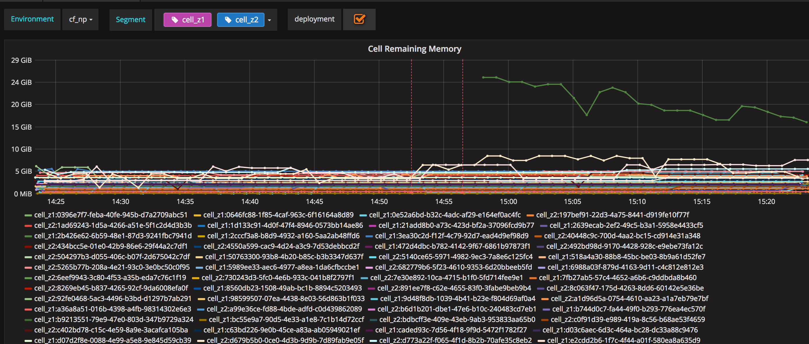

# cf-metrics
A project for monitoring and alerting with cloudfoundry utilizing the [InfluxData TICK stack](https://www.influxdata.com/time-series-platform/)

## Architecture and Data Flow
### Architecture


| Component     | Purpose     |
| ------------- |-------------|
| Loggregator Firehose | collects logs, events, and metrics from all jobs and app containers in cf - [details](https://docs.cloudfoundry.org/loggregator/architecture.html) |
| Firehose Nozzle  | connects to the loggregator firehose and forwards metrics to influxdb  - [details](https://github.com/MonsantoCo/influxdb-firehose-nozzle) |
| Bosh HM Forwarder      |  bosh job which subscribes to BOSH health-monitor metrics and forwards them to the loggregator firehose - [details](https://github.com/cloudfoundry/bosh-hm-forwarder) |
| Bosh HM       | collects vm vitals for all vm's in the cf release and sends events to telegraf - [details](https://bosh.io/docs/monitoring.html) |
| Telegraf      | recieves bosh events in consul protocol format from BOSH HM and sends them to kapacitor for processing - [details](https://docs.influxdata.com/telegraf/v1.3/)  |
| Kapacitor      | streams data from influxdb and telegraf for processing, anomaly detection, and alerting  - [details](https://docs.influxdata.com/kapacitor/v1.3/)  |
| Influxdb      | stores the incoming metric streams for persistence - [details](https://docs.influxdata.com/influxdb/v1.3/) |
| Grafana       | provides dashboards for viewing metric data in influxdb - [details](http://grafana.org/) |
| Slack         | receives alerts and event notifications from kapacitor - [details](https://slack.com/) |

For this project we have packaged the InfluxDB, Telegraf, Kapacitor, firehose nozzle, and Grafana components into a [docker compose](https://docs.docker.com/compose/) enviornment to allow for a compact and easily portable solution.

## Setup
To run the project, you will need the following:

1.  A working bosh/cloud-foundry enviornment utilizing the Cloud Foundry Diego architecture 
2.  A docker host with [docker](https://docs.docker.com/engine/installation/#server) and [docker compose](https://docs.docker.com/compose/install/) installed and configured.  This project has been tested with docker and docker-compose versions 17.03.1-ce 

### Firehose ClientID & Secret

Update the following section in your cloud foundry manifest and redeploy cf to enable a uaa client for the firehose nozzle:
```
properties:
  uaa:
    clients:
      influxdb-firehose-nozzle:
        access-token-validity: 1209600
        authorized-grant-types: authorization_code,client_credentials,refresh_token
        override: true
        secret: <password>
        scope: openid,oauth.approvals,doppler.firehose
        authorities: oauth.login,doppler.firehose
```

### Docker Host and Container Configuration 
First clone this repo to the docker host and change the following files to reflect your environment:

#### InfluxDB Compose Configuration
docker-compose.yml: update this to reflect the name of your cf enviornment, which will be the database name in influx
```
  environment:
  - PRE_CREATE_DB=cf_np  
```

#### Nozzle Compose Configuration
The firehose nozzle is configured via environment variables in the docker-compose.yml.  Variables passed here override the ones built inside the nozzle container via the nozzle json file.  At a minimum, you will want to change these six variables to reference your cf deployment.  The database and deployment names given here should match the env given as the influxd database above:
```
  NOZZLE_UAAURL=https://uaa.cf-np.company.com
  NOZZLE_CLIENT=client_id
  NOZZLE_CLIENT_SECRET=secret
  NOZZLE_TRAFFICCONTROLLERURL=wss://doppler.cf-np.company.com:443
  NOZZLE_DEPLOYMENT=cf_np
  NOZZLE_INFLUXDB_DATABASE=cf_np
```
Additional environment variable options can be found in the [upstream project](https://github.com/MonsantoCo/influxdb-firehose-nozzle)

#### Grafana Dashboard Configuration
If you changed your PRE_CREATE_DB value above, then make the following changes:
```
grafana/load.sh: replace any string of 'cf_np' with your PRE_CREATE_DB value
grafana/dashboards/import_format/*.json: replace any string of 'cf_np' with your PRE_CREATE_DB value
```

#### Kapacitor Compose Configuration
docker-compose.yml:: update the following environment variables for your slack instance
```
  KAPACITOR_SLACK_URL=https://hooks.slack.com/services/XXXX/YYYYY/ZZZZZZZZZZZZZ
  KAPACITOR_SLACK_CHANNEL=#bot-testing
```

kapacitor/``*.tick``: If you are using the built in tick scripts, you will have to update the vars at the top of the tick scripts such as _grfana_url_,_grafanaenv_, _database_, or _slackchannel_ to represent your enviornment.

### BOSH Setup

#### BOSH HM Forwarder
Follow the directions in the [bosh-hm-forwarder](https://github.com/cloudfoundry/bosh-hm-forwarder-release) project to either deploy a dedicated bosh release for the forwarder, or add the job to an existing job in your cf deployment.  Instructions for adding the job to the existing consul_z2 job of your cf deployment are below:

Upload the release to your director

```
bosh target <director IP>
bosh upload release https://bosh.io/d/github.com/cloudfoundry/bosh-hm-forwarder-release
```
Add the following items to your consul_z2 job section and the releases section of your cf.yml
```
jobs:
- default_networks:
  - name: cf2
  name: consul_z2
  templates:
  - name: boshhmforwarder
    release: bosh-hm-forwarder

releases:
- name: cf
  version: latest
- name: bosh-hm-forwarder
  version: latest
```
Do a bosh deploy for your cf deployement

#### BOSH HM

Update the following section in your bosh manifest and redeploy bosh to enable the bosh monitor statistics:
```
    hm:
      tsdb_enabled: true
      tsdb:
        address: <ip of the bosh-hm-forwarder job (IP of consul_z2 VM in this example) >
        port: 4000
      consul_event_forwarder_enabled: true
      consul_event_forwarder:
        host: <ip of your docker host>
        port: 8125
        protocol: http
        events: true
        heartbeats_as_alerts: true
```

## Running the Compose Application
In the top level of the project directory, use the following command to create the docker compose application and verify successful start:
```
 docker-compose up -d && docker-compose ps
```
### Enabling the Kapacitor tick scripts
Auto-defining and enabling the included tick scripts is currently not supported in Kapacitor, so you need to manually log into kapacitor after it is up and enable any desired scripts.  In the below example it assumes your influx database is cf_np.  If you changed PRE_CREATE_DB above, then substitute your database name below for the -dbrp field

**will be addressed by https://github.com/influxdata/kapacitor/pull/1481**
```
docker exec -it <idofkapacitorcontainer> bash

cd /etc/kapacitor/
kapacitor define etcd_alert_np -type stream -tick etcd_alert_np.tick -dbrp cf_np.autogen
kapacitor enable etcd_alert_np
kapacitor define slow_consumer_np -type stream -tick slow_consumer_np.tick -dbrp cf_np.autogen
kapacitor enable slow_consumer_np
kapacitor define swap_alert_np -type stream -tick swap_alert_np.tick -dbrp cf_np.autogen
kapacitor enable swap_alert_np
kapacitor define job_health_np -type stream -tick job_health_np.tick -dbrp cf_np.autogen
kapacitor enable job_health_np
kapacitor define persistent_disk_np -type stream -tick persistent_disk_np.tick -dbrp cf_np.autogen
kapacitor enable persistent_disk_np
kapacitor define cpu_wait_alert_np -type stream -tick cpu_wait_np.tick -dbrp cf_np.autogen
kapacitor enable cpu_wait_alert_np
kapacitor define bosh_event_np -type stream -tick bosh_event_np.tick -dbrp telegraf_np.autogen
kapacitor enable bosh_event_np
kapacitor define max_container_np -type stream -tick max_container_np.tick -dbrp cf_np.autogen
kapacitor enable max_container_np

kapacitor list tasks
```

## Usage
Grafana will be configured for the datasources you specified in the config file (cf_np & influx by default) and will have some preloaded  dashboards which show relevant cf and bosh metric data. 

You can use grafana to create you're own dashboards or the following dashboards have been included:


Cloud Foundry Job specific dashboards use metrics from the Firehose to show things like Cell available memory ratios and CPU load.  Annotations are included to show "bosh deploy" events and enable correlation between changes and incidents.


VM dashboards provide VM level statistics from BOSH Monitor to show things like ephemeral disk or swap utilzation.


Enabled tick alert scripts in Kapacitor (such as Cell memory and bosh deploy's) will go to your slack channel for team notification.  You can also modify the Kapacitor tickscripts to send alerts to any number of supported alert [event handlers](https://docs.influxdata.com/kapacitor/v1.3/nodes/alert_node/) like email or pagerduty.


