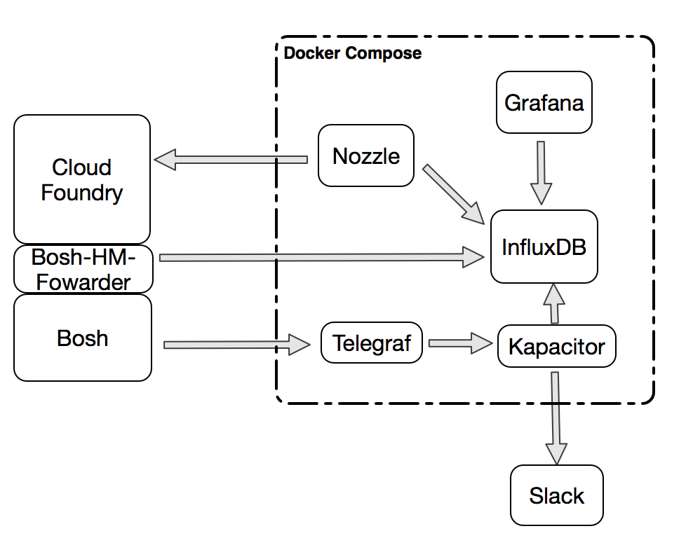
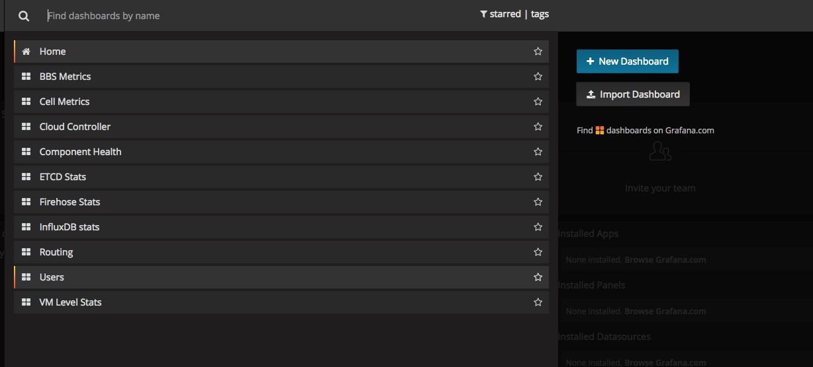

#cf-metrics
A project for monitoring and alerting with cloudfoundry utilizing the [CF collector](https://github.com/cloudfoundry/collector), [Bosh Monitor](https://bosh.io/docs/monitoring.html), [heka](https://github.com/mozilla-services/heka), [influxdb](https://github.com/influxdb/influxdb), and [grafana](https://github.com/grafana/grafana)

## Why
Monitoring and alerting are critical features for any platform which supports non-trival workloads.  Cloudfoundry provides various components which monitor and track the health of its Key Performance Indicators (KPI's) but for the most part it lacks an out-of-the-box solution which ties all these components together.  There are some existing blog posts ([example](http://blog.pivotal.io/pivotal-cloud-foundry/products/monitoring-pivotal-cloud-foundry-health-and-status-hybrid-models-kpis-and-more)) which provide solutions to this issue, but they tend to rely on closed-source proprietary components.  The goal of this project is to provide a comprehensive solution for CF monitoring and alerting based solely on open source projects.  

## Architecture and Data Flow
### Architecture


| Component     | Purpose     |
| ------------- |-------------|
| CF Collector  | collects metrics from all /varz and /healthz jobs in cf - [details](https://github.com/cloudfoundry/collector) |
| Bosh HM       | collects vm vitals for all vm's in the cf release - [details](https://bosh.io/docs/monitoring.html) |
| Heka          | stream processer for data streams from collector and HM to use for monitoring, alerting, anomaly detection - [details](http://hekad.readthedocs.org/en/v0.9.2/)  |
| Influxdb      | open source time series database for persistent storage of metric data streams - [details](http://influxdb.com/docs/v0.9/introduction/overview.html) |
| Grafana       | the leading metrics dashboard for influxdb - [details](http://grafana.org/) |
| Slack         | team collaboration and communication tool.  Chatops for alerts- [details](https://slack.com/) |

For this project, we have packaged the heka, influxdb, and grafana components into a [docker compose](https://docs.docker.com/compose/) enviornment to allow for a compact and easily poratable solution.

### Data Flow
CF collector and bosh monitor gather /varz and /healthz metrics from all cf jobs as well as OS statistic from all bosh controlled VM's via local agents.  These components are configured to forward data to heka in graphite format and consul.  Heka decodes this input and streams it through multiple filters for anomaly detection and threshold based alerting.  The relevant data from the stream also gets forwarded to influxdb for persistence and dashbaords available through grafana.  Any alerts or anomalies which get detected in the heka sandboxes get encoded and sent to a configured slack channel for chatops.

## Setup
To run the project, you will need the following:

1.  A working bosh/cloud-foundry enviornment
2.  A docker host with [docker](https://docs.docker.com/installation/ubuntulinux/) and [docker compose](https://docs.docker.com/compose/#installation-and-set-up) installed and configured.  This project has been tested with docker v1.7.1 and docker-compose v1.3.3

### Docker Host and Container Configuration 
First clone this repo to the docker host and change the following files to reflect your enviornment:

#### Compose Configuration
cf-metrics->docker-compose.yml: update this list to reflect the names of your cf enviornment(s) yml parameter for "deployment name"
```
  environment:
  - PRE_CREATE_DB=cf_sbx;cf_cnb;bosh_sbx;bosh_cnb  
```
#### Heka Configuration
cf-metrics->heka->heka.toml: update the following sections to reflect your enviornment(s) based on the comments in the file.  Or comment them out if you don't any of the specific alerts
```
 [DEA_Avail_Mem_Prd]
 [DEA_Avail_Mem_NP]
 [CFHealth_NP]
 [CFHealth_Prd]
 [Bosh_Swap_Prd]
 [Bosh_Swap_NP]
 [SlackOutput]
 [SlackEncoder.config]
 [SlackOutput]
 [influxdb-output-bosh-alerts-prd]
 [influxdb-output-bosh-alerts-np]
 [influxdb-output-cf-np]
 [influxdb-output-cf-prd]
 [influxdb-output-bosh-np]
 [influxdb-output-bosh-prd]
```

#### Grafana Configuration
cf-metrics->grafana->grafana.ini: update the following section to reflect the fqdn of your docker host:
```
 # The public facing domain name used to access grafana from a browser
 domain = server.company.com
```

#### Running the Compose Application
In the top level of the project directory, use the following command to create the docker compose application and verify successful start:
```
 docker-compose up -d && docker-compose ps
```

### BOSH & Cloud Foundry Setup
_*** You will need to use bosh version >= v171 to have the consul_forwarder bosh monitor plugin.  This plugin is used for bosh deploy event annotations.  If you are using a bosh version prior to v171, leave out the consul_event_forwarder configuration and you will get everything except bosh deploy annoations.***_

_*** Bosh/CF will complain if you configure an endpoint which is not currently listening for connections.  Make sure you have the heka container running and listening on the configured ports before you update your bosh and cf deployments***_

Update the following section in your bosh manifest and redeploy bosh to enable the bosh monitor statistics:
```
graphite_enabled: true
    graphite:
      address: <ip of your docker host>
      port: 8004
      prefix: bosh-prod
    consul_event_forwarder_enabled: true
    consul_event_forwarder:
      host: <ip of your docker host>
      port: 8500
      protocol: http
      events: true
      heartbeats_as_alerts: false
```

Update the following section in your cloud foundry manifest and redeploy cf to enable cf job statistics:
```
collector:
    deployment_name: cf-prod  #name of your cf environment
    graphite:
      address: <ip address of your docker host>
      port: 8003
    use_graphite: true
```
## Usage
Before you can use grafana to show metrics you need to configure datasources for it to querry and create dashboards.  You can do this manually via the UI or by following the example api requests included in the cf-metrics->grafana->README.md file.  These examples will configure the datasource for influxdb and import some stored dashboards which show relevant cf and bosh metric data. 

After configuring the datastores you should have a bosh and cf database for each enviornment you're monitoring


You can then use grafana to create you're own dashboards or the following dashboards have been included:


Cloud Foundry Job specific dashboards use metrics from CF Collector to show things like DEA available memory ratios and CPU load.  Annotations are included to show "bosh deploy" events and enable correlation between changes and incidents.


VM dashboards provide VM level statistics from Bosh Monitor to show things like ephemeral disk or swap utilzation.


Enabled alerts from heka (such as DEA memory and bosh deploy's) will go to your slack channel for team notification.  You can also modify the heka configuration to send alerts to an email address if you prefer.


## What about the firehose?
If CF collector is being deprecated, why not use [firehose](https://github.com/cloudfoundry/loggregator) for this project?

Firehose should be an exciting feature for cloudfoundry, but it has yet to achieve metric parity with the existing CF collector component.  We look forward to porting this project from CF Collector once work on firehose completes.  Or we'd love a PR for a firehose branch if you just can't wait :-)
